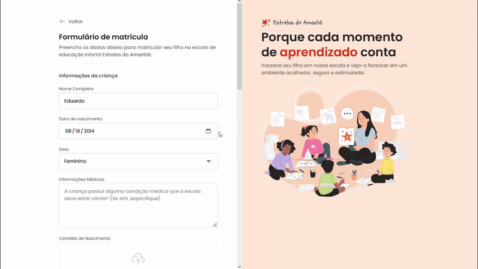

# 📝 Projeto Formulario de Matricula 📝
Desafio prático desenvolvido durante Formação Full-Stack promovida pela Rocketseat
___
## 🗃️ Layout direcionado para páginas de cadastro
  

  
___
### 🤖 Tecnologias e Recursos  
  
* HTML
* CSS
* Git
* Figma
* Notion  
  
#### 🔎 Você pode conferir o resultado clicando [aqui](https://arturtinoco.github.io/formulario-de-matricula/) ou ver o projeto no [Figma](https://www.figma.com/community/file/1365016793556649696) feito por [Ilana Mallak](https://www.linkedin.com/in/ilanamallak/).  